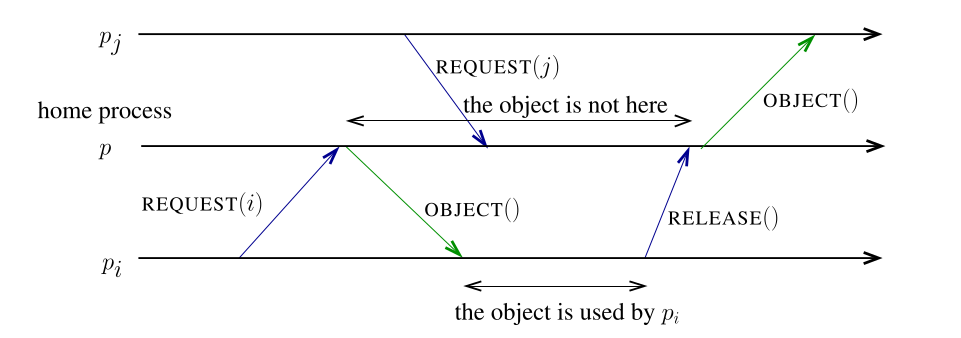
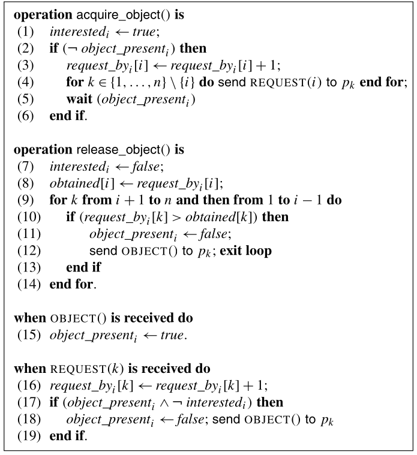

# Distributed Navigation Algorithm for Complete Networks

An implementation of a navigational networks for mobile objects on complete networks following the definition put forward by Michel Raynal in _Distributed Algorithm's for Message Passing Systems._

### Example graph:

### Raynal's psuedocode:

